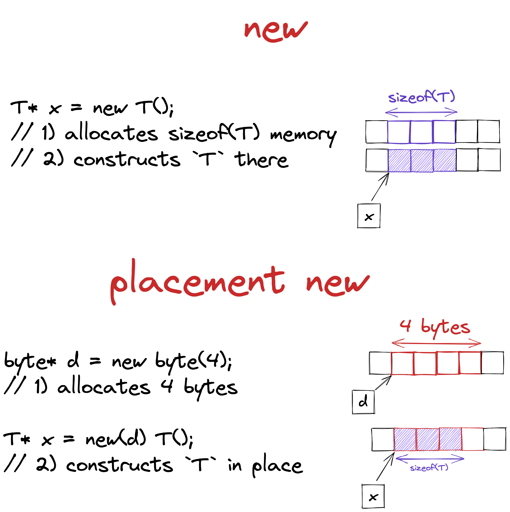

# Intro
Please don't ask me why, but I decided to write an `std::variant` from scratch. It turned out to be what I think is the most interesting container to implement. It requires a deep dig into the guts of C++, including:
1. `const` correctness
2. Exception safety
3. Placement new
4. Variadic templates
5. Combining templates in run time and compile time

And even more.

I didn't know a lot of stuff required to build proper `std::variant`, so I had to look for clues in the code of available variant implementations. And they are not built for clarity of reading. That's why I decided to write a clear follow up to my endeavour and I hope it might help anyone reading to learn more about C++.

I think the best way to work with this text is to start building `std::variant` yourself. And look for answers here in case of trouble. That's why text is structured to tackle one function of variant at time. And every block ends with plan on what we'll build next, so you may stop and try before seeing my solution. If you are familiar with what `std::variant` is you may jump straight to the part [Building our own Variant](building-our-own-variant). But in case you are not - what is `std::variant`?

# What is variant?

## Union
You've probably heard about `union` in C and C++. If you've not - `union` is a way to reuse same **stack** storage for different types. The size of stack space used is only as large as the maximum of said types.

```cpp
union S
{
    int32_t i; // occupies 32 bits
    char8_t c; // occupies 8 bits
};             // the whole union occupies 4 bytes

int main() {
    S s;                    // uninitialized union
    std::cout << sizeof(s); // prints 4 (on a system where 1 byte == 8 bit)
    s.i = 1;                // assign big_int
    std::cout << s.i;       // prints '1's
    s.c = 'a';              // reassign small_int
    std::cout << s.c;       // prints 'a'
}
```


Unfortunately `union` is very easy to misuse:

```cpp
S s;              // uninitialized union
s.i = 1;          // assign int32_t
std::cout << s.c; // OOPS - undefined behaviour
```

And as we all know UB is very bad - it happens only in runtime and very hard to catch. There are much more subtle problems with unioin, like the fact that you need to explicitly call proper destructors for more complex types.

You might be wondering why would anyone ever want to share space between types. And I'll link you to [this Stackoverflow](https://stackoverflow.com/questions/4788965/when-would-anyone-use-a-union-is-it-a-remnant-from-the-c-only-days) answer for lengthy explanation. But in short:
1. Performance optimization
2. Bit trickery
3. Different way to handle polymorphism

The 3-rd point can be illustrated with implementation of `JsonValue`. For simplicity our `JsonValue` holds one of integer, string or other `JsonValue`.

**TODO goto doc**

The danger of using union actually makes usage of `union` for polymorphism much underappreciated. And all the danger boils down to the fact, that `union` make the user do all type bookkeeping. That's exactly what `std::variant` saves user from.

## Variant
`std::variant` uses some extra space to hold type information, so it prevents illegal access by throwing `std::bad_varaint_access`.

```cpp
int main() {
    std::variant<int32_t, char8_t> v{1}; // variant now holds int32_t{1}
    std::cout << std::get<char8_t>(v);   // throws std::bad_variant_access
}
```

If the type is not from expected list of types, error is actually compile time!

```cpp
int main() {
    std::variant<int32_t, char8_t> v{1}; // variant now holds int32_t{1}
    std::cout << std::get<floats>(v);      // compile time error
}
```

Safety has a cost and `variant` is slightyly bigger than union, because it has to store type information somewhere.

```cpp
std::cout << sizeof(S) << "\n" << sizeof(std::variant<int32_t, char8_t>) << std::endl;
```

# Building our own Variant
```cpp
template<typename... Types>
class Variant {
};
```

We can't actually just put `union` inside our variant class, so we'll have to improvise. How do we allocate enough storage to hold all our types?

## Storage
First of all we need **stack** storage with size equals to `sizeof` of a maximum of sizes of all `Types...`. We can do this using `std::array`:

```cpp
template<typename... Types>
class Variant {
    std::array<std::byte, MaxSizeof<Types...>::value> storage_;
};
```

`MaxSizeof` will be implemented with recursive approach to unrolling variadic templates:

```cpp
template<typename T, typename... Types>
struct MaxSizeof {
private:
    constexpr static auto maxSizeof = MaxSizeof<Types...>::value;
public:
    constexpr static auto value = sizeof(T) > maxSizeof ? sizeof(T) : maxSizeof;
};

template<typename T>
struct MaxSizeof<T> {
    constexpr static auto value = sizeof(T);
};
```

I think the best way to understand this recursion is try to understand what compiler has to generate for specific example.

```cpp
// For following definition
MaxSizeof<int8_t, int32_t, int16_t>::value

// Compiler will generate this code
template<int8_t, int32_t, int16_t>
struct MaxSizeof {
    private:
        constexpr static auto maxSizeof = MaxSizeof<int32_t, int16_t>::value;  // dependency
    public:
        constexpr static auto value = sizeof(int8_t) > maxSizeof ? sizeof(int8_t) : maxSizeof;
}

// Now compiler sees dependency on MaxSizeof<int32_t, int16_t>::value and will have to generate
template<int32_t, int16_t>
struct MaxSizeof {
    private:
        constexpr static auto maxSizeof = MaxSizeof<int16_t>::value; // dependency
    public:
        constexpr static auto value = sizeof(int32_t) > maxSizeof ? sizeof(int32_t) : maxSizeof;
}

// Now compiler sees dependency on MaxSizeof<int16_t>::value
// It also sees specialization for a single type and will have to use that for generation
template<int16_t>
struct MaxSizeof {
    constexpr static auto value = sizeof(int16_t);
}

// This leads to following values:
MaxSizeof<int16_t>::value == 2;
MaxSizeof<int32_t, int16_t>::maxSizeof == MaxSizeof<int16_t>::value == 2;
MaxSizeof<int32_t, int16_t>::value == (4 > 2) ? 4 : 2 == 4
MaxSizeof<int8_t, int32_t, int16_t>::maxSizeof == MaxSizeof<int32_t, int16_t>::value == 4;
MaxSizeof<int8_t, int32_t, int16_t>::value == (1 > 4) ? 1 : 4 == 4
```

Now `Variant` has exact size of maximum type it holds.

```cpp
std::cout << sizeof(Variant<int32_t, char8_t>); // prints 4
```

How do we place someting in `Variant`'s storage?

## Construction
We want to make this code work:
```cpp
Variant<int32_t, char8_t> v{1};
```

It's a constructor, and `Variant` needs a family of constructors with every type from `Types...` as a parameter:
```cpp
template<typename... Types>
class Variant {
    Variant(char8_t&& x);
    Variant(int32_t&& x);
};
```
So we'll use constructor template, accepting any type `T`.

```cpp
template<typename T>
Variant(T&& var) {
}
```

[placement new](https://en.cppreference.com/w/cpp/language/new) can be used to copy construct value inside `Variant`'s storage . Placement new does not allocate memory as new does. Instead it uses provided chunk of memory and calls constructor of object to initialize it.



```cpp
template<typename T>
Variant(const T& var) {
    new(storage_.data()) T(var);
}
```

You may already see the problem - right now we can place any type `T` inside our storage. Let's continue with implementing ther rest of the interface for now. This and other problems'll become obvious and we'll fix them along the way, I promise.
Next, how do we get the value back from `Variant`?

## GetIf
The simplest value we can get value from `Variant` is a strongly typed pointer to `storage_`. It's tempting to simply cast `storage_` to a pointer of a desired type `T*` using two `static_cast` operations.
```cpp
template<typename T>
T* any_cast() {
    return *static_cast<T*>(static_cast<void*>(storage_.data()));
}
```

Unfortunately it's the same undefined behaviour as with union if we guessed wrong. Coincidentally this function will be useful to us, so let's leave it for now.

In order to avoid UB `get_if` can call `any_cast` only if guessed type `T` is the type of value in `storage_`. Otherwise `nullptr` is returned. That's why the standard calls this function `get_if`. To do so we'll need to store some type information to check in `get_if`.

How do we store type information?

### Saving type info
Let's go back to the constructor and use very simple type info - index of the type in the sequence. `size_t` is used for index type, because length of pack `sizeof...(Types..)` has this type. It'll be definetly enough to store our index, so let's use it.

```cpp
template<typename... Types>
class Variant {
public:
    template<typename T>
    Variant(T&& var)
    : type_idx_{IndexOf<T, Types...>::value} {
        new(storage_.data()) T(var);
    }

private:
    size_t type_idx_;
    std::array<std::byte, MaxSizeof<Types...>::value> storage_;
};
```

And we'll once again implement `IndexOf<>` recursively:

```cpp
template<typename Search, size_t Idx, typename T, typename... Types>
struct IndexOfImpl {
    static constexpr size_t value = IndexOfImpl<Search, Idx + 1, Types...>::value;
};

template<typename Search, size_t Idx, typename... Types>
struct IndexOfImpl<Search, Idx, Search, Types...> {
    static constexpr size_t value = Idx;
};

template<typename T, typename... Types>
struct IndexOf {
    static constexpr size_t value = IndexOfImpl<T, 0, Types...>::value;
};
```

It's unrolling recursion time!

```cpp
// For following definition
IndexOf<int, char, int, double>::value

// Compiler generates
template<
    T = int,
    Types... = char, int, double
>
struct IndexOf {
    static constexpr size_t value = IndexOfImpl<int, 0, char, int, double>::value;
};

// Now compiler sees dependency on IndexOfImpl<int, 0, char, int, double>::value and will have to generate
template<
    Search = int,
    Idx = 0,
    T = char,
    Types... = int, double
>
struct IndexOfImpl {
    static constexpr size_t value = IndexOfImpl<int, 1, int, double>::value;
};

// Now compiler sees dependency on IndexOfImpl<int, 1, int, double>::value
// And it also matches this specialization: struct IndexOfImpl<Search, Idx, Search, Types...>, so it's used for generation
template<
    Search=int,
    Idx = 1,
    Types... = double>
struct IndexOfImpl<
    Search = int,
    Idx = 1,
    Search = int,
    Types... = double
> {
    static constexpr size_t value = 1;
};

// Now recursion stopped and we got the value
IndexOf<int, char, int, double>::value == IndexOfImpl<int, 1, int, double>::value == 1
```

`IndexOf` works and it gave us bonus feature. Now constructor forbids types not present in `Types...` - `IndexOf<int, char, double>` recursion stops with compile error. That's because when `Types...` sequence ends it doesn't provide explicit `typename T` template requires.

```cpp
template<
    Search=int,
    Idx = 2,
    T = ???
>
struct IndexOfImpl;
```

The above constructor produces compiler error with initialization from references.
```cpp
int x = 1;
variant_i::Variant<int> v{x}; // OOPS compiler error "too few template arguments for class template 'IndexOfImpl'"
```

It's the result of special rules of references collapsing in templates. We can see it inn the line compiler tries to instantiate `Variant<int>::Variant<int &>`. The type `T` guessed by compiler is `int&` which cannot be found in the type sequence `Types...` of `Variant<int>`. In order to get correct type we'll use `std::decay_t`, so we'll end up with following constructor declaration .

```cpp
template<typename T>
Variant(T&& var)
: type_idx_{IndexOf<std::decay_t<T>, Types...>::value} {
    new(storage_.data()) std::decay_t<T>(std::forward<T>(var));
}
```

`std::variant` is generally 4 bytes smaller than `Varaint` on my system.

```cpp
struct S {
    std::byte x[32];
};

std::cout << sizeof(std::variant<S>);        // prints 36
std::cout << sizeof(variant_i::Variant<S>);  // prints 40
```

It seems that `std::variant` uses 32 bit integer to store type index, whereas `Variant` uses 64 bit. I couldn't find any limit on a number of arguments in variadic template, so I assume that compiler vendors just know that the limit fits into 32bit integer and use that.

Now that we have `type_idx_` stored, we can proceed with `get_if`. Actually there are two versions of it - typed and indexed.

```cpp
std::variant<int, char> v;
std::get_if<int>(&v); // tries to get variable of type int
std::get_if<0>(&v);   // tries to get first type, which is also int
```

Which one should we implement first? I didn't know when I started to build variant, but it allows repeats of the same type. Yes, `variant<int, int, int>` is allowed. In such case `get_if<int>` gives a compile time error because it's not clear which `int` was requested. This makes `get<index>` the basic building block, so let's start from it.

How do we implement `get<index>`?

### `get_if<index>`
Indexed get is a bit hard to start with, because we can't even write a proper declaration for it.

```cpp
template<size_t Idx>
T* get_if(); // what's T?
```

Moreover in standard it's declared as friend, but let's just deal with that later. Let our first goal be getting type `T` at index `Idx` from list of `Types...`.

```cpp
template<size_t Idx, size_t CurIdx, typename T, typename... Types>
struct TypeAtIdxImpl {
    using type = TypeAtIdxImpl<Idx, CurIdx + 1, Types...>::type;
};

template<size_t Idx, typename T, typename... Types>
struct TypeAtIdxImpl<Idx, Idx, T, Types...> {
    using type = Ts;
};

template<size_t Idx, typename... Types>
struct TypeAtIdx {
    using type = typename TypeAtIdxImpl<Idx, 0, Types...>::type;
};

template<size_t Idx>
TypeAtIdx<Idx, Types..>::type* get_if();
```

Is it plane? Is it bird? No, it's variadic recursion.

```cpp
// For following definition
TypeAtIdx<1, char, int, double>::type

// Compiler generates
template<
    size_t Idx = 1,
    typename... Types = char, int, double>
struct TypeAtIdx {
    using type = typename TypeAtIdxImpl<1, 0, char, int, double>::type;
};

// Now compiler sees dependecy on typename TypeAtIdxImpl<1, 0, char, int, double>::type
template<
    size_t Idx = 1,
    size_t CurIdx = 0,
    typename U = char,
    typename... Types = int, double>
struct TypeAtIdxImpl {
    using type = TypeAtIdxImpl<1, 1, int, double>::type;
};

// Now compiler sees dependecy on typename TypeAtIdxImpl<1, 1, int, double>::type
// And provided specialization matches
template<
    size_t Idx = 1,
    typename T = int,
    typename... Types = double>
struct TypeAtIdxImpl<1, 1, int, double> {
    using type = int;
};

// Now recursion stopped and we got the type
TypeAtIdx<1, char, int, double>::type == TypeAtIdxImpl<1, 0, char, int, double>::type == TypeAtIdxImpl<1, 1, int, double>::type == int
```

Now that we have `TypeAtIdx`, `get_if` becomes easy to implement.

```cpp
template<size_t Idx>
TypeAtIdx<Idx, Types...>::type* get_if() {
    if(Idx != type_idx_) {
        return nullptr;
    } else {
        using T = TypeAtIdx<Idx, Variant<Args...>>::type;
        return any_cast<T>();
    }
}
```

Let's think about return type a little bit. What if variant holds a reference `Variant<int&>`? Return type of `get_if` becomes `int&*` which is illegal in C++, because it's a pointer to a reference. The better way to convert type to a pointer is `add_pointer_t`. It decays types correctly.

```cpp
template<size_t Idx>
std::add_pointer_t<TypeAtIdx<Idx, Types...>::type> get_if();

template<typename T>
std::add_pointer_t<T> any_cast();
```

I lied to you - `std::variant` is not permitted to hold references, arrays, or the type void. Typee decay is not relevant in our case, but I find `add_pointer_t` to be more readable so I'll leave it. Let's leave forbidding implementation as a debt for later and deal with more prominent problems.

<details>
    <summary>Side note about `add_pointer_t`</summary>
    There is an interesting <a href="https://cplusplus.github.io/LWG/issue2101">read on decaying types</a> by `add_pointer`, which I'll leave for you to explore. But in short - `add_pointer_t` has a special case for `void() const`. It is not a mistake, const qualified <b>non-member</b> function a legal function type in C++, whcih can never be instantiated and only exists as type.
</details>

We kinda leaked implementation detail which is `TypeAtIdx` to the public interface of `Variant`. `std::variant` has a thing similar to our `TypeAtIdx` called `variant_alternative_t`. It's used as a return type for `std::get_if`. The difference from `TypeAtIdx` is that `variant_alternative_t` implemented only for `std::variant`, and not for any sequence of types. It's quite simple to build our own `VariantAlteernativeT` using `TypeAtIdx`.

```cpp
template<size_t Idx, typename T>
struct VariantAlternative;

template<size_t Idx, typename T>
using VariantAlternativeT = typename VariantAlternative<Idx, T>::type;

// VariantAlternative must be declared before Variant to be used internally
template<typename... Types>
class Variant {
    std::add_pointer_t<VariantAlternativeT<Idx, Variant<Types...>>> get_if();
};

// VariantAlternative specialization for Variant must be defined after Variant's definition
template<size_t Idx, typename... Types>
struct VariantAlternative<Idx, Variant<Types...>> {
    using type = typename TypeAtIdx<Idx, Types...>::type; // forward all the work to TypeAtIdx
};
```

If you're confused about declaration-definition ordering, don't worry I'm with you. But I think it works because when a user tries to use `get_if` the compiler sees all the declarations and definitions required to compile.

Okay that was a lot. Now we have a problem with constant `Variant`.

```cpp
const Variant<int> x{1};
x.get_if<0>(); // get_if is not constant
```

How do we implement `get_if<index>() const`?

### `get_if<index>() const`
The obvious idea is to copy-paste and add `const`s. `get_if() const` requires only chage in declaration, the implementation may stay the same.

```cpp
template<size_t Idx>
std::add_pointer_t<const VariantAlternativeT<Idx, Variant<Types...>>> get_if() const;
```

It calls `any_cast`, so we'll also need a constant version of that.

```cpp
template<typename T>
const T* any_cast() const {
    return *static_cast<const T*>(static_cast<void*>(storage_.data()));
}
```

Now it works, but can we do better, without code duplication? Basically, what we want is to either call `get_if() const` from `get_if` or vice versa. Vice versa is forbidden by compilers, so let's proceed with the first option. Naive take leads to compile error.

```cpp
template<size_t Idx>
std::add_pointer_t<VariantAlternativeT<Idx, Variant<Types...>>> get_if() {
    const auto* cthis = this;
    return cthis->get_if<Idx>();  // OOPS `const T*` is not convertible to `T*`
}
```

Will `const_cast` help us with the compiler error?

```cpp
template<size_t Idx>
std::add_pointer_t<VariantAlternativeT<Idx, Variant<Types...>>> get_if() {
    using T = VariantAlternativeT<Idx, Variant<Types...>>;
    const auto* cthis = this;
    return const_cast<std::add_pointer_t<T>>(cthis->get_if<Idx>());
}
```

Yes it helped, but does it cause undefined behaviour? Answer to this question depends on the context of `const_cast` usage. It's legal to cast away constness from pointer or reference, when the originally referenced object was not `const`.

```cpp
int x = 0;
const int* cptr_x = &x;
int* ptr_x = const_cast<int*>(cptr_x); // perfectly legal because x is orginally non-const

const int y = 0;
const int* cptr_y = &y;
int* ptr_y = const_cast<int*>(cptr_y); // OOPS undefined because y is originally const
```

This makes `const_cast` legal in our case, because non-constant version of `get_if` can be only called with non-const object.

```cpp
Variant<int> x {1};
x.get_if<int>(); // calls const_cast, but original memory is non-const

const Variant<int> y {1};
y.get_if<int>(); // calls get_if() const, so no const cast

Variant<int>& ref_y = y; // compiler error
ref_y.get_if<int>();     // won't get there
```

In order to cause UB in `Variant`'s code, one must call illegal `const_cast` before `get_if`, so it's not out problem.

```cpp
const Variant<int> y {1};

Variant<int>& ref_y = const_cast<Variant<int>&>(y); // OOPS UB - casting away constness of orginally const object
ref_y.get_if<int>();                                // illegal `const_cast` here doesn't matter
```

We can also get rid of non-const `any_cast`, because now `get_if()` just calls `get_if() const`.

How do we turn `get_if` to free function, that accepts `Variant<Types...>` as a parameter?

### free
Let's start with changing implementations of `get_if`.

```cpp
template<size_t Idx, typename... Args>
std::add_pointer_t<const VariantAlternativeT<Idx, Variant<Args...>>> get_if(const Variant<Args...>* variant) {
    if(variant == nullptr || Idx != variant->type_idx_) {
        return nullptr;
    } else {
        return variant-> template any_cast<T>();
    }
}

template<size_t Idx, typename... Args>
std::add_pointer_t<VariantAlternativeT<Idx, Variant<Args...>>> get_if(Variant<Args...>* variant) {
    using T = VariantAlternativeT<Idx, Variant<Types...>>;
    const auto* cvariant = variant;
    return const_cast<std::add_pointer_t<T>>(get_if<Idx>(cvariant));
}
```

We had to add `nullptr` check and the quirk with `variant-> template any_cast`. The latter one is not so obvious. From my point of view it does not make sense for compiler to require `template` here, so I can't explain it well. Let me explain it using an example where it's necessary.

```cpp
variant->func<0>(13);
// compiler can't tell whether it's call to a function or something like
(variant->func < 0) > (13)
// so compiler requires explicit `template` keyword to be sure, that it's a call to a template function
variant-> template func<0>(13);
```

In the case of `get_if` the second option is even weirder `(variant->any_cast < T) > ()`. `T` is a type and there is no comparison operator for types as far as I know. The rest of the line also gives more questions - what the hell is `> ()`? I don't know why compiler requires `template` in our case, but we'll let it to have this one.

`get_if` access `Variant`'s private section, so it needs to be declared friend. This is pretty straightforward if you don't try to overthink it and just copy to class.

```cpp
template<typename... Types>
class Variant {
    template<size_t Idx, typename... Args>
    friend std::add_pointer_t<const VariantAlternativeT<Idx, Variant<Args...>>> get_if(const Variant<Args...>* variant);
};
```

`Types...` from `Variant`'s can't be used for friend declaration because linker will complain, that it can't find right function to call. And linker is right to do so, cosider these two functions.

```cpp
template<typename... Types>
class Variant {
    friend void function1(const Variant<Types...>* variant);
};

template<typename... Args>
void function2(const Variant<Args...>* variant)
```

They have two different signatures. `function1` is a template function with it's own parameter pack. `function2` is a weird thing, that just uses parameter pack of class, even though it has not relation to it. So it doesn't pay off to be smart here and reuse `Varaint`'s parameter pack.

Non-const version of `get_if` doesn't need to be declaraed friend, because it just calls const `get_if`. So that's the only friend declaration we'll need. Neat.

Ok, so what's about other typed version of `get_if`?

### `get_if<T>`

Now that we have `IndexOf` implemented and type index stored, `get<T>` becomes rather easy to implement using `get_if<index>`.

```cpp
template<typename T, typename... Args>
std::add_pointer_t<const T> get_if(const Variant<Args...>* variant) {
    return get_if<IndexOf<T, Args...>::value>(variant);
}

template<typename T, typename... Args>
std::add_pointer_t<T> get_if(Variant<Args...>* variant) {
    return get_if<IndexOf<T, Args...>::value>(variant);
}
```

And that's it with `get_if`. `std::variant` has other type of accessor, which returns references and throws on invalid type. It's called `get`.

How do we implement it?

### get<T>

Let's first talk about what we need to implement. The documentation has 4 overloads of `get<T>` function:

```cpp
template<typename T, typename... Args>
T& get(Variant<Args...>& variant);
T&& get(Variant<Args...>&& variant);
const T& get(const Variant<Args...>& variant);
const T&& get(const Variant<Args...>&& variant);
```

You might be wondering, what is `const T&&`? You don't see that much often, because it what happens when you return `const T` from a function.

```cpp
const int f();
f(); // returned type of F is const int&&
```

But as `std::variant` needs to be as generic as possible, it needs to cover this case.
The situation with four overloads is much like with `const` and `non-const` `get_if` versions - which one should we implement to be the base of all the rest? The type that all three others are convertible to is `const T&`.

```cpp
void clref(const int& x);

void lref(int& x) {
    clref(x);
}

void rref(int&& x) {
    clref(x);
}

void crref(const int&& x) {
    clref(x);
}
```

We only need to implement `get` for `const Variant&`. It was easier to talk about `get<T>` but it's once again better to start with `get<index>`. The implementation is based on `get_if`.

```cpp
template<size_t Idx, typename... Args>
const VariantAlternativeT<Idx, Variant<Args...>>& get(const Variant<Args...>& variant) {
    const auto* content = get_if<Idx>(&variant);
    if (content) {
        return *content;
    } else {
        throw std::runtime_error("Variant holds different alternative");
    }
}
```

All other `get<index>` function just use the  one above.
```cpp
template<size_t Idx, typename... Args>
VariantAlternativeT<Idx, Variant<Args...>>& get(Variant<Args...>& variant) {
    using T = VariantAlternativeT<Idx, Variant<Args...>>;
    const auto& cvariant = variant;
    return const_cast<T&>(get<Idx>(cvariant));
}

template<size_t Idx, typename... Args>
VariantAlternativeT<Idx, Variant<Args...>>&& get(Variant<Args...>&& variant) {
    return std::move(get<Idx>(variant));
}

template<size_t Idx, typename... Args>
const VariantAlternativeT<Idx, Variant<Args...>>&& get(const Variant<Args...>&& variant) {
    return std::move(get<Idx>(variant));
}
```

Typed versions of `get` use their indexed counterparts.

```cpp
template<typename T, typename... Args>
const T& get(const Variant<Args...>& variant) {
    return get<IndexOf<T, Args...>::value>(variant);
}

template<typename T, typename... Args>
T& get(Variant<Args...>& variant) {
    return get<IndexOf<T, Args...>::value>(variant);
}

template<typename T, typename... Args>
T&& get(Variant<Args...>&& variant) {
    return std::move(get<T>(variant));
}

template<typename T, typename... Args>
const T&& get(const Variant<Args...>&& variant) {
    return std::move(get<T>(std::move(variant)));
}
```

And that's finally it with all versions of `get`. Now we have a `Variant`, that we can construct and access it's value. Now the time to think about end of `Varaint`'s lifecycle.

How should `Variant` be destructed?

## Destruction
Placement new can't be cleaned up with simple `delete` call. Code must explictly call appropiate destructor.

```cpp
std::array<std::byte, sizeof(T)> storage; // allocate storage
T* tptr = new(storage.data()) T;          // save type using pointer
tptr->~T();                               // delete explicitly
```

In our case it's a bit worse beacuse we can't actually save a pointer of type `T`. And even though we have `TypeAtIdx` it's not usable in runtime.

```cpp
~Variant() {
    using T = TypeAtIdx<type_idx_, Types...>;  // this does not work
    type_cast<T>()->~T();
}
```

Destructor can't be called recursively to iterate `Types...` , so a helper function is needed. It will iterate through the sequence of indexes `0..sizeof...(Types)` and call proper destructor on hitting appropriate one.

```cpp
template<size_t Idx>
void destroy() {
    if (Idx != type_idx_) {
        destroy<Idx + 1>();
    } else {
        using T = typename TypeAtIdx<Idx, Types...>::type;
        any_cast<T>()->~T();
    }
}
```

When compiled this code will give a long long error message boiling down to.

```
error: too few template arguments for class template 'TypeAtIdxImpl'
    using type = TypeAtIdxImpl<Idx, CurIdx + 1, Types...>;
```

That's because compiler doesn't know when to stop recursion. For example for `Variant` with just one element compiler will generate following function `destroy`:

```cpp
Variant<int> v;

template<0>
void destroy() {
    if (0 /*Idx*/ != type_idx_) {
        destroy<1>();
    } else {
        using T = char;
        any_cast<T>()->~T();
    }
}
```
Compiler can't predict, that this function never actually hits the line `destroy<1>();`, so compiler must generate `destroy<1>`. And this leads to error.

```cpp
template<1>
void destroy() {
    if (1 /*Idx*/ != type_idx_) {
        destroy<2>();
    } else {
        using T = typename TypeAtIdx<1, int>::type; // OOPS there is no Type with index 1
        any_cast<T>()->~T();
    }
}
```

The solution is to write explicit stop for recursion as template specialization.
```cpp
template<>
void destroy<sizeof...(Types)>() {}
```

Now compiler will generate just one function, see our specialization and stop.

```cpp
template<0>
void destroy() {
    if (0 /*Idx*/ != type_idx_) {
        destroy<1>();
    } else {
        using T = char;
        any_cast<T>()->~T();
    }
}

template<1>
void destroy() {}
```

Now our `Variant` is properly destructed! Let's add some simple bits.

## Other
### `Variant::index()`
Returns `type_idx_` stored in `Variant.`

```cpp
size_t index() {
    return type_idx_;
}

size_t index() const {
    return type_idx_;
}
```

### `Variant::swap()`
Swaps two `Variants`.

```cpp
void swap(Variant& other) {
    std::swap(type_idx_, other.type_idx_);
    std::swap(storage_, other.storage_);
}
```

### `hold_alternative`
Checks that `Variant` holds provided type.

```cpp
template<typename T, typename... Types>
bool holds_alternative(const Variant<Types...>& v) {
    return v.index() == IndexOf<T, Types...>::value;
}
```


### `variant_size`
Returns size of the variadiac type sequnce.

```cpp
template<typename T>
struct VariantSize;

template<typename... Types>
struct VariantSize<Variant<Types...>>: std::integral_constant<size_t, sizeof...(Types)> {
};

template<typename T>
inline constexpr size_t VariantSizeV = VariantSize<T>::value;
```

### Default constructor
`Variant`'s deefault constructor tries to default construct the first type in the sequence of types if it's default-constructible. If it's not - it leads to a compilation error.

```cpp
Variant()
: type_idx_{0} {
    using T = typename TypeAtIdx<0, Types...>::type;
    new(storage_.data()) T();
}
```

### Align
**TODO**

## Conclusion
Let's recap - now we have a pretty neat little `Variant`. It has proper construction and destruction. The stored value can be type-safely retrieved and modified. But there are two big missing parts:
- `Variant` can't be copied or moved.
- The type of stored value can't be changed
```cpp
Variant<int, char> x {1};
x = 'a';                  // OOPS can't change types
Variant<int, char> y = x; // OOPS no copy constructor
y = x;                    // OOPS no copy assignment
```

Both operations are connected to a topic we've not covered yet - exception safety. It adds a whole new layer of complexity to a `Variant`, so let's just leave it for part 2 of our journey of creating `std::varaint` from scratch. I may need to split the rest of topics to part 2 and 3, but we'll cover:
- exception safety and `valueless_by_exception`
- variant::emplace
- copy and move constructors
- copy and move assignments
- comparison operators
- Variant::visit
- Variant::hash
- Repeated types in `Variant` i.e. `Variant<int, int, int>`
- `type_traits` correctness as well as other compile time constraints for `Variant`

I hope yo've enjoyed the read and please leave me comments and questions.
