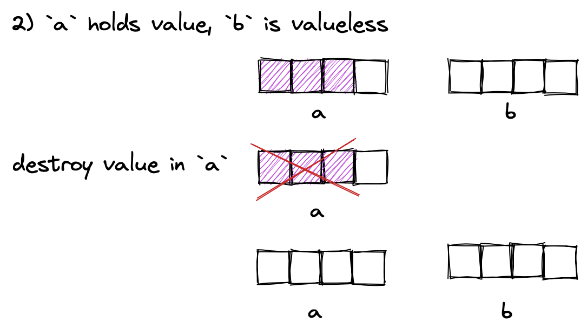

# Building variant from scratch part II - concepts and exceptions in constructors and assignments
## Intro
Before we start I must say that this article went off the road very quickly. I planned to quickly get over copy and move constructors and jump straight to the juicy part of exception handling in `emplace` and `operator=`. Turned out that adding a copy constructor requires telling the compiler which constructor to choose, using shiny new C++20 concepts (or SFINAE if you're not hip). And if you want to make constructor right - you have to go deep with concepts, function overloading and C++ type system. The dig of concepts is deep enough to require clang built from trunk (Septmber 2022). I recomend these two articles on cppreference to recap: [concepts](https://en.cppreference.com/w/cpp/language/constraints) and [noexcept](https://en.cppreference.com/w/cpp/language/noexcept_spec). Full code is in files [variant_ii.hpp](variant_ii.hpp) and [test/test_ii.cpp](test/test_ii.cpp).

Let's gently start thinking about exceptions, recap all functions of `Variant` and try to add an appropriate `noexcept` specifier. Just to recap, `noexcept` specifier divides functions in two groups - *non-throwing* and *potentially throwing*. All functions are potentially throwing by default (except destructors, but more on that later). To make function non-throwing - `noexcept` specifier is added to the end of function definition. `noexcept` does not prevent to throw from function, but if such function throws - [std::terminate](https://en.cppreference.com/w/cpp/error/terminate) is called. I recommend reading [this stackoverflow answer](https://stackoverflow.com/questions/10787766/when-should-i-really-use-noexcept) on why is `noexcept` useful, however in short it allows for optimizations (which you'll see later) as well as it shows what to expect from a function to its users.

What's been already implemented in `Variant`? Firstly destructors are `noexcept` by default, you can throw exception but you [don't want to](https://isocpp.org/wiki/faq/exceptions#dtors-shouldnt-throw). Our implementation just calls the appropriate destructor, so it's also `noexcept`.

```cpp
Variant<Types...>::~Variant();
```

Index accessors can be marked `noexcept` - they just return integer, no exceptions here.

```cpp
size_t Variant<Types...>::index() noexcept;
size_t Variant<Types...>::index() noexcept const;
```

`holds_alternative` calls `index` and uses return value to check type `T`, so also no exceptions here.

```cpp
template<typename T, typename... Types>
bool holds_alternative(const Variant<Types...>& v) noexcept;
```

Next we have a family of `get_if` functions. They all can be marked `noexcept`, because they just compare and cast. Once again - nothing exceptions related.

```cpp
// get_if<0>(Variant*) index based pointer accessors, return nullptr on wrong type
template<size_t Idx, typename... Args>
const T* get_if(const Variant<Args...>* variant) noexcept;
T* get_if(Variant<Args...>* variant) noexcept;

// get_if<int>(Variant*) type based pointer accessors, return nullptr on wrong type
template<typename T, typename... Args>
const T* get_if(const Variant<Args...>* variant) noexcept;
T* get_if(Variant<Args...>* variant) noexcept;
```

Eight `get` functions are obviously non `noexcept` because they throw exception on bad variant access.

```cpp
// get<0>(Variant&) index based accessors, throw on wrong type
template<size_t Idx, typename... Args>
const T& get(const Variant<Args...>& variant);
T& get(Variant<Args...>& variant);
const T&& get(const Variant<Args...>&& variant);
T&& get(Variant<Args...>&& variant);

// get<int>(Variant&) type based accessors, throw on wrong type
template<typename T, typename... Args>
const T& get(const Variant<Args...>& variant);
T& get(Variant<Args...>& variant);
const T&& get(const Variant<Args...>&& variant);
T&& get(Variant<Args...>&& variant);
```

Just as a reminder, two helper classes were implemented.

```cpp
template<size_t Idx, typename... Types>
struct VariantAlternativeT<Idx, Variant<Types...>>;  // holds type of the element in sequence Types... at index Idx

template<typename... Types>
struct VariantSize<Variant<Types...>>; // holds size of sequence Types...
```

I left default & converting constructors for the last course because they are more interesting. A default constructor of `Variant` calls a default constructor of the first type in `Types...`. That means potential exception throwing depends on the said constructor of the first type. Fortunately, `noexcept()` specifier comes with brackets and may receive compile-time `bool` value to identify throwing category. `noexcept` with no brackets is just a shorthand for `noexcept(true)`.

```cpp
void f() noexcept(true);  // non-throwing function
void g() noexcept(false); // potentially throwing function
```

A type trait can be used to control `Variant`'s `noexcept` specifier.

```cpp
Variant() noexcept(std::is_nothrow_default_constructible_v<typename TypeAtIdx<0, Types...>::type>)
```

Converting constructor is even more interesting, but we'll need to introduce copy and move constructors first because their presence affects declaration of converting constructor.

How do we implement copy and move constructors?

# Copy & Move constructors
## Copy constructor
It's tempting to simply memcopy memory and type index on copy, however that breaks copy requirements for some types. Consider `shared_ptr`.

```cpp
Variant<shared_ptr<int>> x{make_shared<int>{1}};
Variant<shared_ptr<int>> y = x;
```

Reference counter must be 2, however if `Variant` just bare copies memory and type index, reference counter is equal to 1. That means copy must call the appropriate type's copy constructor. It needs to be done recursively, so the approach will be similar to a destructor implementation.

```cpp
Variant(const Variant& other)
:type_idx_{other.type_idx_} {
    copy_construct<0>(other);
}

template<size_t Idx>
void copy_construct(const Variant& other) {
    if (Idx != other.type_idx_) {
        copy_construct<Idx + 1>(other);
    } else {
        using T = typename TypeAtIdx<Idx, Types...>::type;
        new(storage_.data()) T(get<Idx>(other));
    }
}

// specialization to stop recursion
template<>
void copy_construct<sizeof...(Types)>(const Variant&) {}
```

The logic here is exactly like we used in [destructor](part_i.md#destruction) - recursively finding the right type to copy construct. Unfortunately, if we try to copy `Variant` this code gives a compile time error.

```cpp
Variant<shared_ptr<int>> x{make_shared<int>{1}};
Variant<shared_ptr<int>> y = x; // OOPS compile time error
```

That happens because compiler sees two potential functions to call - copy constructor and a converting constructor template.

```cpp
Variant(const Variant&); // copy constructor
template<typename T = Variant>
Variant(Variant&); // converting constructor
```

From these two, compiler chooses the more appropriate one without `const`, and that neither works nor what we've meant. We need to forbid compiler to use converting constructor on copies (or moves) and we can do that with shiny new C++ 20 concepts.

### Concepts to the rescue
The concepts feature is a way to tell a compiler which types are allowed to be used with a template. That's exactly what we need with our converting constructor - we need to forbid a compiler to use it with an argument of type `Variant`.

```cpp
template<typename T>
Variant(T&& var)
requires (!std::is_same_v<std::remove_cvref_t<T>, Variant>)
: type_idx_{IndexOf<std::remove_cvref_t<T>, Types...>::value} {
    new(storage_.data()) std::remove_cvref_t<T>(std::forward<T>(var));
}
```

Notice `requires` keyword after declaration - it's one of several ways to restrict a type. When it is followed by brackets, you can put any compile time boolean expression to restrict a template. We required that decayed `T` must not be the same as `Variant`. Now converting constructor does not interfere with copy constructor and everything's great on that front. But while we are still here with converting constructor, let's look at requirements at [cppreference](https://en.cppreference.com/w/cpp/utility/variant/variant).

> Constructs a variant holding the alternative type `T_j` that would be selected by overload resolution for the expression `F(std::forward<T>(t))` if there was an overload of imaginary function `F(T_i)` for every `T_i` from `Types...`s in scope at the same time, except that:
> - An overload `F(T_i)` is only considered if the declaration `T_i x[] = { std::forward<T>(t) };` is valid for some invented variable x;
> Direct-initializes the contained value as if by direct non-list-initialization from `std::forward<T>(t)`.
> This overload participates in overload resolution only if
> - `sizeof...(Types) > 0`,
> - `std::remove_cvref_t<U>` is neither the same type as variant, nor a specialization of `std::in_place_type_t`, nor a specialization of std::in_place_index_t,
> - `std::is_constructible_v<T_j, T>` is true,
> - and the expression `F(std::forward<T>(t))` (with F being the above-mentioned set of imaginary functions) is well formed.

Wow, that's a huge list of requirements. Even though going through them looks like a daunting task - I'll promise we'll dig deeper inside concepts and type conversions. That'll be a great fun (at least in some opinions).

### Requirements for converting constructor
The thing that strikes us first - converting constructor doesn't use type `T` as our implementation does. Instead, it deduces type `T_j` that can be converted from `T`. The deduction process is based on C++ overload resolution principles. We can simulate the process of picking `T_j` from `Types...` using clever inheritance technique.

```cpp
template<typename... Types>
struct ChooseConvertible {
    static void F(...);
};

template<typename To, typename... Types>
struct ChooseConvertible<To, Types...>: ChooseConvertible<Types...> {
    using ChooseConvertible<Types...>::F;

    static To F(To);
};
```

Let me unroll this for you.
```cpp
int x;
ChooseConvertible<int, double>::F(x);

// Compiler has to generate ChooseConvertible<int, double>
// It chooses specialization
template<
    typename To = int,
    typename... Types = double>
struct ChooseConvertible: ChooseConvertible<double> {
    using ChooseConvertible<double>::F;

    static int F(int);
};

// Now compiler has to generate ChooseConvertible<double>
// Sppecialization is once again better fit
template<
    typename To = double,
    typename... Types = <> >
struct ChooseConvertible: ChooseConvertible<> {
    using ChooseConvertible<>::F;

    static double F(double);
};

// Now compiler has to generate ChooseConvertible<>
// Specialization can't be used because it requires at least one typename To
template<>
struct ChooseConvertible {
    static void F(...);
};
```

In a way we packed a bunch of overloads inside one `ChooseConvertible<int, double>` class with [using declaration](https://en.cppreference.com/w/cpp/language/using_declaration).

```cpp
template<int, double>
struct ChooseConvertible {
    static void F(...);
    static double F(double);
    static int F(int);
};
```

`F(...)` is called [variadic arguments](https://en.cppreference.com/w/cpp/language/variadic_arguments), has no relationship to [variadic templates](https://en.cppreference.com/w/cpp/language/parameter_pack), and exists in C++ for compatibility with C mostly. What's interesting to us is that `F(...)` has the lowest overload resolution priority of all overloads.
Now when `ChooseCovertible<int, double>::F(x)` is called, compiler tries to choose from the set of overloads.

```cpp
int x;
vector<int> v;
ChooseConvertible<int, double>::F(x); // ChooseConvertible::F(int) is selected - it's the exact match
ChooseConvertible<int, double>::F(v); // None of strong typed function fits - ChooseConvertible::F(...) is selected
```

`ChooseConvertible` allows building a type trait to select `T_j` from `Types...`. There is no value `t` to forward like in a requirement `std::forward<T>(t)`, instead [std::declval](https://en.cppreference.com/w/cpp/utility/declval) can be used. It's a way to call a function requiring arguments in compile-time context without declaring a variable to pass as argument.

```cpp
template<typename From, typename... Types>
using ChooseConvertibleT = decltype(ChooseConvertible<Types...>::F(std::declval<From>()));
```

This type trait deduces the return type of a call `F(From&&)`. When compiler can call a function from a set of `To F(To)` converting a parameter from `From` to `To` - resulting type is `To`. If nothing from `Types...` can be converted from `From` - the lowest priority overload `void F(...)` is chosen, and the result type is `void`. That allows us to build another trait to detect whether a type is convertible from another.

```cpp
template<typename From, typename... Types>
constexpr static bool IsConvertibleV = !std::is_same_v<ChooseConvertibleT<From, Types...>, void>;
```

Now this type trait can be used to restrict a conversion constructor.

```cpp
template<typename T>
Variant(T&& var)
requires (
    !std::is_same_v<std::remove_cvref_t<T>, Variant>
    && IsConvertibleV<T, Types...>
)
```

There is a problem with implemented type trait - we ignored the part allowing overload to participate in the resolution only if the declaration `T_i x[] = { std::forward<T>(t) };` is valid for some invented variable `x`. What does that mean, and how does it affect us?

### Narrowing conversions
If you'll look close enough you'll see, that initialization above is [list initialization](https://en.cppreference.com/w/cpp/language/list_initialization). The main thing it prevents is narrowing conversion. I think that standard committee people would just explicitly tell about narrowing conversion if that was the only thing. However, I can't think of anything else that applies to our case. If you know it - I'd greatly appreciate you correcting me.

Narrowing conversion is one that might lose information. For example, conversion from `int` to `char` is a narrowing one because `int` might hold a value, that doesn't fit into `char`. The fact that `Varaint` hasn't yet forbidden this type of conversion leads to interestingly wrong behaviour.

```cpp
struct Int {
    Int(int) {}
};

std::variant<Int, char> x{1}; // chooses Int
assert(x.index() == 0);
Variant<Int, char> y{1}; // chooses char
assert(x.index() == 1);
```

That's because when compiler chooses between conversions - standard one such as `int` to `char` is always preferred over a user defined one such as `Int(int)`. Unfortunately, it's not enough to tweak `ChooseConvertible` to accept initializer lists.

```cpp
template<typename To, typename... Types>
struct ChooseConvertible<To, Types...>: ChooseConvertible<Types...> {
    using ChooseConvertible<Types...>::F;

    static To F(std::initializer_list<To>);
};

template<typename From, typename... Types>
using ChooseConvertibleT = decltype(ChooseConvertible<Types...>::F({std::declval<From>(), })); // notice comma - it's essential

ChooseConvertibleT<int, char, Int>;
```

This generates compile time error `non-constant-expression cannot be narrowed from type 'int' to 'char' in initializer list`. That's because compiler still prefers standard int-to-char conversion to user defined, it's just an error to choose that one in initializer list context. Initializer list makes compiler to drop all guessing in case of small ambiguity and delegate the choice to a user. In this case, we have to remove undesired overloads from the set. Does that idea sound familiar? Yes, we can once again do that with concepts.

```cpp
template<
    typename From,
    typename... Types>
struct ChooseConvertible {
    static void F(...);
};

template<
    typename From,
    typename To,
    typename... Types>
requires (IsNarrow<From, To>)
struct ChooseConvertible<From, To, Types...>: ChooseConvertible<From, Types...> {
    using ChooseConvertible<From, Types...>::F;
};

template<
    typename From,
    typename To,
    typename... Types>
requires (!IsNarrow<From, To>)
struct ChooseConvertible<From, To, Types...>: ChooseConvertible<From, Types...> {
    using ChooseConvertible<From, Types...>::F;

    static To F(To);
};

template<typename From, typename... Types>
using ChooseConvertibleT = decltype(ChooseConvertible<From, Types...>::F(std::declval<From>()));
```

The idea is nearly the same as before, we now have two specifications, and they are controlled by the requirement `IsNarrow<From, To>`. When this requirement is not satisfied - struct is empty, otherwise it provides an `F` candidate. Type traits library doesn't have `std::is_narrowing_convertible_v<From, To>` type trait, but there is a [proposal](https://open-std.org/JTC1/SC22/WG21/docs/papers/2020/p0870r2.html). I nicked an implementation from there:

```cpp
template<typename T1, typename T2>
concept IsSame = std::is_same_v<T1, T2>;

template<typename From, typename To>
concept NotNarrow = requires (From&& from) {
    {std::type_identity_t<To[]>{std::forward<From>(from)}} -> IsSame<To[1]>;
};
```

The code above is another way to define a constraint on type. Up to this point, we only used `requires` with a boolean expression. Keyword `concept` elevates this idea to another level - it's possible to list all the requirements inside `requires {}`. We required `To` to be constructible from `From` in an initializer list context. [type_identity_t](https://en.cppreference.com/w/cpp/types/type_identity) is just a clever way to define an array of `To` similar to `To[] x` without introducing a name. This array is initialized with a list of one value `from`. The arrow bit `->` requires the return value of this initialization be array of `To[]` with only one element. Only concepts can follow arrow `->`, so we had to define a concept `IsSame`. What we did is exactly the same thing required in `std::variant` converting constructor `To x[] = { std::forward<From>(from) };`, it's just phrased differently.

Ok, we're finally done with converting restriction, let's look at the others listed on cppreference.

> `sizeof...(Types) > 0`

We could add that one, but in my opinion it doesn't make sense - empty `Variant<>` is already forbidden.

> `std::remove_cvref_t<U>` (since C++20) is neither the same type as variant, nor a specialization of `std::in_place_type_t`, nor a specialization of std::in_place_index_t

We already have one forbidding `T` to be `Variant`. We haven't yet used `in_place_*` types, they are a debt from the first part. Let's add restriction here and implement them a bit later.  We'll need to construct a special type trait.

```cpp
template<typename T>
struct IsInPlaceSpecialization: std::false_type {
};

template<typename T>
struct IsInPlaceSpecialization<std::in_place_type_t<T>>: std::true_type {
};

template<size_t Idx>
struct IsInPlaceSpecialization<std::in_place_index_t<Idx>>: std::true_type {
};

template<typename T>
constexpr bool IsInPlaceSpecializationV = IsInPlaceSpecialization<T>::value;
```

> std::is_constructible_v<T_j, T> is true

That one is easy to add.

Let's finally think about `noexcept` specifier. Whether an exception happens or not depends entirely on the conversion from `T` to `T_j`. There is a useful type trait to determine exactly that `std::is_nothrow_convertible<To, From>`. Now the complete definition for converting constructor is ready. Notice how `noexcept` specifier must go before `requires` because it's a part of a function declaration.

```cpp
template<typename T>
Variant(T&& var)
noexcept(std::is_nothrow_constructible_v<ChooseConvertibleT<T, Types...>, T>)
requires (
    !std::is_same_v<std::remove_cvref_t<T>, Variant>
    && IsConvertibleV<T, Types...>
    && !IsInPlaceSpecializationV<std::remove_cvref_t<T>>
    && std::is_constructible_v<ChooseConvertibleT<T, Types...>, T>
)
: type_idx_{IndexOf<ChooseConvertibleT<T, Types...>, Types...>::value} {
    new(storage_.data()) ChooseConvertibleT<T, Types...>(std::forward<T>(var));
}
```

Let's remember that we started things with concepts to enable a copy constructor. Let's finish it.

### Finally full copy constructor
Copy constructor has its own constraints and `noexcept` specifiers, but let's start with the fact that it's sometimes deleted and sometimes trivial. This makes type uncopiable and has another benefit - when copy constructor always defined or deleted it prevents compiler from generating move constructor. It'll come in handy later. In other words, if one of types in variant is neither copy nor move constructible just deleting copy constructor makes everything okay. We can manage that with concepts, if any of `Types...` is not copy constructible - delete copy constructor.

```cpp
Variant(const Variant& other)
requires (!(std::is_copy_constructible_v<Types> && ...)) = delete;
```

The other thing is trivial copy constructor. Trivial means that it's compiler-generated, and it simply copies memory from one object to another. That's perfectly legal for a `Variant` of fundamental types, for example. There is no need to call any constructors, just copying `storage_` and `type_idx_` is fine.

```cpp
Variant<int, double, char> x {'a'};
auto y = x;  // just fine
```

One way to make constructor trivial is to default it when all `Types...` are trivially copy constructible.

```cpp
Variant(const Variant& other)
requires (std::is_trivially_copy_constructible_v<Types> && ...) = default;
```

That leaves our non-trivial copy constructor, that we implemented earlier, with the rest of requirements. It's defined only when all the types are copy constructible and not all of them are trivially copy constructible.

```cpp
Variant(const Variant& other)
requires ((std::is_copy_constructible_v<Types> && ...) && !(std::is_trivially_copy_constructible_v<Types> && ...))
:type_idx_{other.type_idx_} {
    copy_construct<0>(other);
}
```

Now let's deal with `noexcept`. For some reason, the standard doesn't have a `noexcept` specification for the copy constructor of `std::variant`. That doesn't seem to have a purpose, and there is even a [proposal](https://cplusplus.github.io/LWG/issue2991) to fix that. MSVC seems to have appropriate noexcept specifiers implemented for copy constructor. So let's just here be ahead of the standard and add specifier ourselves. It's pretty simple - noexcept if all types inside are nothrow copy constructible `noexcept((std::is_nothrow_copy_constructible_v<Types> && ...))`. The deleted constructor doesn't need this, so we'll just slap it on the other two and live with that.

That's finally all with copy constructor and the converting one. After that move constructor will be an easy walk.

## Move constructor
It's very similar to a copy constructor - same recursive index comparison. Move constructor is defaulted when every type in `Types` is trivially move constructible. It's `noexcept` when every type in `Types` is nothrow move constructible. We don't need to delete move constructor because there is always a copy constructor defined, which prevents a compiler from generating move constructor.

```cpp
Variant(Variant&& other)
noexcept((std::is_nothrow_move_constructible_v<Types> && ...))
requires (std::is_trivially_move_constructible_v<Types> && ...) = default;

Variant(Variant&& other)
noexcept((std::is_nothrow_move_constructible_v<Types> && ...))
requires ((std::is_move_constructible_v<Types> && ...) && !(std::is_trivially_move_constructible_v<Types> && ...))
:type_idx_{other.type_idx_} {
    move_construct<0>(std::move(other));
}

template<size_t Idx>
void move_construct(Variant&& other) {
    if (Idx != other.type_idx_) {
        move_construct<Idx + 1>(std::move(other));
    } else {
        using T = typename TypeAtIdx<Idx, Types...>::type;
        new(storage_.data()) T(get<Idx>(std::move(other)));
    }
}

template<>
void move_construct<sizeof...(Types)>(Variant&&) {}
```

In the end let's complete the set of constructors with `in_place` ones.

## In place constructors

These constructors are used to construct types from variadic arguments in place.

```cpp
struct IntConvertible {
    IntConvertible(int);
};

Variant<int, IntConvertible> x{std::in_place_index<1>, 3}; // constructs IntConvertible{3}
Variant<int, IntConvertible> y{std::in_place_type<IntConvertible>, 3}; // same
```

These constructors construct object from `args` and exist only when `Idx < sizeof...(Types)` and type `T` is constructible from `Args...`.

```cpp
template<typename T, typename... Args>
Variant(std::in_place_type_t<T>, Args&&... args)
    requires(IndexOf<T, Types...>::value < sizeof...(Types) && std::is_constructible_v<T, Args...>)
:type_idx_{IndexOf<T, Types...>::value} {
    new(storage_.data()) T(std::forward<Args>(args)...);
}

template<size_t Idx, typename... Args>
Variant(std::in_place_index_t<Idx>, Args&&... args)
    requires(Idx < sizeof...(Types) && std::is_constructible_v<typename TypeAtIdx<Idx, Types...>::type, Args...>)
:type_idx_{Idx} {
    using T = typename TypeAtIdx<Idx, Types...>::type;
    new(storage_.data()) T(std::forward<Args>(args)...);
}
```

There are also overloads of these constructors with an `initializer_list` argument, but I don't think they affect anything else. Let's leave them.
Now we finally got to the part that deals with exceptions a lot. How do we implement `emplace`?

# Emplace
There are two versions of `emplace` - typed and indexed. Once again, the indexed one is a basic building block, so let's start with that one. `emplace` does two things:
1. Destroys current value
2. Calls appropriate constructor with forwarded arguments to create a new value

The complication here is a combination of these two factors. Destruction of a value is an irreversible operation. At the same time, construction of a new value may fail and if it does - the previous value is either lost or must be restored somehow. This situation leads to a talk about strong exceptions guarantee vs basic exceptions guarantee.

## Exceptions guarantees
Beloved cppreference lists [4 exception guarantees](https://en.cppreference.com/w/cpp/language/exceptions):
1. Nothrow (or nofail) exception guarantee - the function never throws exception.
2. Strong exception guarantee - if the function throws an exception, the state of the program is rolled back to the state just before the function call.
3. Basic exception guarantee - if the function throws an exception, the program is in a valid state. No resources are leaked, and all objects' invariants are intact.
4. No exception guarantee - if the function throws an exception, the program may not be in a valid state: resource leaks, memory corruption, or other invariant-destroying errors may have occurred.

Nobody wants no exception guarantee, leaking resources and what not. And with `emplace` we can't provide nothrow exception guarantee, so we are left with strong and basic ones. Let's start with a strong exception guarantee.

`The state of the program is rolled back to the state just before the function call.` Rolling back sounds exhausting, and it's usually possible to write code in a way that an exception happens before any change to the program state. In our case, that means that `emplace` needs to call constructor first and then destroy value. That's can be done with a [copy-and-swap idiom](https://stackoverflow.com/questions/3279543/what-is-the-copy-and-swap-idiom).

```cpp
template<size_t Idx, typename... Args>
void emplace(Args&&... args) {
    using T = typename TypeAtIdx<Idx, Types...>::type;
    // potentially throwing operation first
    T tmp{std::forward<Args>(args)...};
    // if above succeeded - do irreversible destroy
    std::swap(get<Idx>(*this), tmp);
}
```

It works because the current value was transferred to `tmp`, which is destroyed on the function escape. That's one way to have strong exception guarantee with `emplace`. Unfortunately, it kinda limits benefits of `emplace` because it still used additional memory.

In order not to pay for what you don't use, `std::variant` does not provide strong exception guarantee, but only the basic one. If an exception happens, resources are not leaked, but `std::variant` is left in an empty state called `valueless_by_exception`. `type_idx_` has a special value called `variant_npos` in this state.

```cpp
inline constexpr size_t variant_npos = -1;

template<typename... Types>
class Variant {
    template<size_t Idx, typename... Args>
    void emplace(Args&&... args) {
        using T = typename TypeAtIdx<Idx, Types...>::type;
        // destroy first
        destroy<0>();
        // make variant empty
        type_idx_ = variant_npos;
        // construct new value, if throws - Variant remains empty
        new(storage_.data()) T(std::forward<Args>(args)...);
        type_idx_ = Idx;
    }
};
```

Even better idea would be to put `type_idx_ = variant_npos;` inside `destroy` function after a successfull destructor call.

```cpp
template<size_t Idx>
void destroy() {
    if (Idx != type_idx_) {
        destroy<Idx + 1>();
    } else {
        using T = typename TypeAtIdx<Idx, Types...>::type;
        any_cast<T>()->~T();
        type_idx_ = variant_npos;
    }
}
```

The cool thing about this solution is that we don't need to change anything else for everything to work. All recursive functions - `destroy`, `copy_construct`, `move_construct`, start with a check `if (Idx != type_idx_)` that will never be hit when `type_idx_` equals to `variant_npos`. One small thing we have to add just to be safe is a `static_assert`.

```cpp
template<typename... Types>
class Variant {
static_assert(sizeof...(Types) < variant_npos);
...
};
```

It's not an optimal solution because it checks all alternatives before quiting. One might add another check `if (variant_npos != type_idx_)` in all recursive functions to quit faster but I won't do it for the sake of readability.

Now `Variant` also needs a way to check for a valueless state.

```cpp
bool valueless_by_exception() const noexcept {
    return type_idx_ == variant_npos;
}
```

Typed emplace delegates all the work to a index based.

```cpp
template<typename T, typename... Args>
void emplace(Args&&... args) {
    emplace<IndexOf<T, Types...>::value, Args...>(std::forward<Args>(args)...);
}
```

Okay, let's move to a more complex thing. How do we implement assignment operator?

# operator=
This set of operators is the most interesting part of `std::variant` in my opinion. Before `std::varaint` there was no place in the standard that talked about assigning a value of type `T` to a value of a totally different type `U`. (I'll probably get bashed for this by people who really know the standard, and I'll be happy to). Assigning `T` to `U` was always a conversion, however `std::variant` changes the whole game.

```cpp
int x = 3;
char c = 'a';
c = x;  // c is still char, converted from int

std::variant<int, char> x = 3;
std::variant<int, char> c = 'a';
c = x;  // c no longer holds char, it holds int
```

The behavior of assignment depends on what's converted to what. [cppreference](https://en.cppreference.com/w/cpp/utility/variant/operator%3D) states 3 types of `operator=` with a list of all cases.

1. Copy-assignment `operator=(const Variant& rhs)`
2. Move-assignment `operator=(Variant&& rhs)`
3. Converting assignment `operator=(T&& t)`

Move-assignment has the shortest list of cases, so let's start with it.

## Move-assignment

Assume we have `Variant` of two types X and Y. Let's discuss all the combinations of different values occurring in a move-assignment.


When both variants are valueless - there is nothing to do.


When a variant with value is assigned from a valueless one - the value is destroyed and variant becomes valueless. Now we are getting to a more interesting case.


From a type's point of view, it doesn't matter whether it's instance stored inside a `Variant` or just on stack, so it's the same as move-assigning two plain variables.


`Variant` must also call move-assignment in this case.


The fourth case is the most interesting one.


There is no conversion from Y to X. The only path here is to destroy value in `a` then move-construct a new one from `b` in now empty space.


This operation is indeed move construction, not move-assignment - it's just initialization of some preallocated and uninitialized space. Whereas move-assignment is a restructuring of already taken space by same type.

That's written in the standard, though phrased differently `this->emplace<rhs.index()>(get<rhs.index()>(std::move(rhs)))`. Let's break it down. `get<rhs.index()>(std::move(rhs))` is `get<Idx>(Variant&&)` resulting in `T_j&&`, which is used in `emplace<rhs.index()>(T_j&& t)`. Remember, that emplace just calls appropriate types' constructor forwarding arguments `T_j(std::forward<T_j>(t))` and that's a move constructor. Let's jump to the code.

```cpp
Variant& operator=(Variant&& other)
{
    if (other.type_idx_ == variant_npos) {
        if (type_idx_ == variant_npos) {
            // 1) both are valueless
            return *this;
        } else {
            // 2) assigned from valueless
            destroy<0>();
            return *this;
        }
    } else if (type_idx_ == other.type_idx_) {
        // 3) both have same type
        move_assign_same_types<0>(std::move(other));
        return *this;
    } else {
        // 4) hold different alternatives
        destroy<0>();
        move_construct<0>(std::move(other));
        type_idx_ = other.type_idx_;
        return *this;
    }
}

template<size_t Idx>
void move_assign_same_types(Variant&& other) {
    if (Idx != other.type_idx_) {
        move_assign_same_types<Idx + 1>(std::move(other));
    } else {
        get<Idx>(*this) = get<Idx>(std::move(other));
    }
}

template<>
void move_assign_same_types<sizeof...(Types)>(Variant&&) {}

// move_construct is the same as in move constructor
```

Once again, sometimes this operation is trivial. It's not enough to request trivial move-assignments from every type in `Types...`, because `Variant`'s move-assignment is sometimes destruction followed by move construction. So for move-assignment to be trivial, all three operations of all types in `Types...` must be trivial. It's more readable to group all of them in one variable.

```cpp
static constexpr bool IsTriviallyMoveAssignable = ((
    std::is_trivially_move_constructible_v<Types>
    && std::is_trivially_move_assignable_v<Types>
    && std::is_trivially_destructible_v<Types>) && ...);
```

Regarding `noexcept` specifier logic is similar - all types in `Types...` should have `noexcept` move-assignment and move-construction. There is no requirement on a nothrow status of potential destructor. However, if you try checking move-assignment of `std::variant` with potentially throwing destructor among `Types...` - it does the right thing.

```cpp
struct ThrowDestuctible {
    ~ThrowDestuctible() noexcept(false);
    ThrowDestuctible(ThrowDestuctible&&) noexcept {}
    ThrowDestuctible& operator=(ThrowDestuctible&&) noexcept { return *this; }
};

static_assert(!std::is_nothrow_move_assignable_v<variant_ii::Variant<ThrowDestuctible>>);
```

That's because in current implementations, `ThrowDestuctible` is not `nothrow_move_constructible`. There is a whole [issue](https://cplusplus.github.io/LWG/issue2116) devoted to this. Destructor call leaks into current implementations of `*_constructible` traits, making them also check nothrow status of a destructor. Until this is fixed - we can stick with two traits on our `Variant`.

```cpp
Variant& operator=(Variant&& other)
noexcept(((std::is_nothrow_move_constructible_v<Types> && std::is_nothrow_move_assignable_v<Types>) && ...))
requires(IsTriviallyMoveAssignable) = default;

Variant& operator=(Variant&& other)
noexcept(((std::is_nothrow_move_constructible_v<Types> && std::is_nothrow_move_assignable_v<Types>) && ...))
requires (!IsTriviallyMoveAssignable && ((std::is_move_constructible_v<Types> && std::is_move_assignable_v<Types>) && ...));
```

There is a good lesson on concepts in `Variant`'s move-assignment. Why is it required for all types to be move-constructible even though it might never happen? That's because concepts help people understand compiler errors. Consider a class that is move-assignable, but not move constructible. Let's try to put it into `Variant` **that does not require move construction trait from types for move-assign to work** and try to use move-assign.

```cpp
struct X {
    X() {}
    X(X&&) = delete;

    X& operator=(X&&) = default;
};

Variant<X> x{};
Variant<X> y{};
y = x; // OOPS compiler error

error: call to deleted constructor of 'T' (aka 'X')
            new(storage_.data()) T(get<Idx>(std::move(other)));
```

Compiler still complains about using deleted move constructor `X(X&&)` even though there is no possibility for it to happen. That's because compiler has to compile whole `operator=(Variant&&)` and there is a usage of deleted function in the one of if branches. Compiler can't check whether this branch is ever used or not. It just compiles and gives an error. It's just nicer to see the requirement to be move-constructible instead of this weird compiler error.

Now let's move to the next more complex thing - copy-assignment.

## Copy-assignment

Let's recap our move-assignments diagram and adjust it for copy-assignments.


It's nearly the same as move-assignment, except we don't leave `b` moved out. However, the standard lists five cases instead of four, because the last one is split in two. The standard wants to use the appropriate copy constructor and avoid potential exception. So if the type in `b` does not throw on copy construction or potentially throws on move - `std::variant` calls copy constructor. Otherwise, if move doesn't throw - it's preferred over potentially throwing copy.

Those cases are stated in the standard, phrased a bit differently. Copy construction is `this->emplace<rhs.index()>(get<rhs.index()>(rhs))`.
`get<rhs.index()>(rhs)` forwards `T_j&` to `emplace` effectively calling constructor `T_j(T_j&)`. Move constructor is delegated to move-assignment `this->operator=(variant(rhs))`.

```cpp
Variant& operator=(const Variant& other) {
    if (other.type_idx_ == variant_npos) {
        if (type_idx_ == variant_npos) {
            // 1) both are valueless
            return *this;
        } else {
            // 2) assigned from valueless
            destroy<0>();
            return *this;
        }
    } else if (type_idx_ == other.type_idx_) {
        // 3) same types - call copy-assignment
        copy_assign_same_types<0>(other);
        type_idx_ = other.type_idx_;
        return *this;
    } else {
        // 4) 5) different types, two cases are inside copy_assign
        destroy<0>();
        copy_assign<0>(other);
        type_idx_ = other.type_idx_;
        return *this;
    }
}

template<size_t Idx>
void copy_assign(const Variant& other) {
    if (Idx != other.type_idx_) {
        copy_assign<Idx + 1>(other);
    } else {
        using T = typename TypeAtIdx<Idx, Types...>::type;
        if constexpr (std::is_nothrow_copy_constructible_v<T> || !std::is_nothrow_move_constructible_v<T>) {
            // 4) copy is better than move - calls copy constructor
            new(storage_.data()) T(get<Idx>(other));
        } else {
            // 5) move is better than copy - calls move constructor
            new(storage_.data()) T(get<Idx>(Variant(other)));
        }
    }
}

template<>
void copy_assign<sizeof...(Types)>(const Variant&) {}
```

Trivial copy-assignment happens when all types in `Types...` are trivially copy-constructible and trivially copy-assignable. Move-assignment doesn't participate because it's just an optimization and it's not involved in trivial copy assignment, only in non-trivial one.

```cpp
static constexpr bool IsTriviallyCopyAssignable = ((
    std::is_trivially_copy_constructible_v<Types>
    && std::is_trivially_copy_assignable_v<Types>
    && std::is_trivially_destructible_v<Types>) && ...);

Variant& operator=(const Variant& other)
requires (!IsTriviallyCopyAssignable && !((std::is_copy_constructible_v<Types> && ...) && (std::is_copy_assignable_v<Types> && ...))) = delete;

Variant& operator=(const Variant& other)
noexcept(((std::is_nothrow_copy_constructible_v<Types> && std::is_nothrow_copy_assignable_v<Types>) && ...))
requires (IsTriviallyCopyAssignable) = default;

Variant& operator=(const Variant& other)
noexcept(((std::is_nothrow_copy_constructible_v<Types> && std::is_nothrow_copy_assignable_v<Types>) && ...))
requires (!IsTriviallyCopyAssignable && (std::is_copy_constructible_v<Types> && ...) && (std::is_copy_assignable_v<Types> && ...));
```

That's all with copy-assignment. Let's move to a converting assignment.

## operator=(T)
We've already made the full converting constructor and know all needed concepts for the conversion assignment. It also uses `ChooseConvertible` to determine type `T_j` to convert to. There are just two cases:
- a variant already holds `T_j`, then call assignment
- Otherwise, destroy content first, then construct from arguments

As with copy construction, the second case is split in two. When it's safe to convert construct - it's used, otherwise the value is moved from temporary.

Concepts and `noexcept` are nearly the same as in converting constructor. We only add `std::is_assignable_v<T_j, T>` to requirements and `is_nothrow_copy_assignable` to `noexcept` specification.


```cpp
template<class T>
Variant& operator=(T&& t)
noexcept(std::is_nothrow_constructible_v<ChooseConvertibleT<T, Types...>, T> && std::is_nothrow_assignable_v<ChooseConvertibleT<T, Types...>&, T>)
requires (
    !std::is_same_v<std::remove_cvref_t<T>, Variant>
    && IsConvertibleV<T, Types...>
    && std::is_constructible_v<ChooseConvertibleT<T, Types...>, T>
    && std::is_assignable_v<ChooseConvertibleT<T, Types...>&, T>
) {
    convert_assign<0>(std::forward<T>(t));
    return *this;
}

template<size_t Idx, typename T>
void convert_assign(T&& t) {
    if (Idx != type_idx_) {
        convert_assign<Idx + 1>(std::forward<T>(t));
    } else {
        using To = ChooseConvertibleT<T, Types...>;
        if constexpr (Idx == IndexOf<To, Types...>::value) {
            // 1) Assigning same alternative as To
            get<Idx>(*this) = std::forward<T>(t);
        } else if (std::is_nothrow_constructible_v<To, T> || !std::is_nothrow_move_constructible_v<To>) {
            // 2) Convert construct
            destroy<0>();
            new(storage_.data()) To(std::forward<T>(t));
            type_idx_ = IndexOf<To, Types...>::value;
        } else {
            // 3) Move construct from temporary
            destroy<0>();
            auto to = To(std::forward<T>(t));
            new(storage_.data()) To(std::move(to));
            type_idx_ = IndexOf<To, Types...>::value;
        }
    }
}

template<size_t Idx, typename T>
void convert_assign<sizeof...(Types)>(T&& t) {}
```

The structure is a bit different from other assignment operators - cases are sorted out inside the last recursion step. Unfortunately, the
above code causes compiler error `function template partial specialization is not allowed`. Once again, concepts will rescue us - instead of partial speciliazation we'll just restrict template index parameter.

```cpp
template<size_t Idx, typename T>
void convert_assign(T&& t)
requires(Idx == sizeof...(Types)) {}
```

The same thing can be done with quite easy [SFINAE](https://en.cppreference.com/w/cpp/language/sfinae).

```cpp
template<size_t Idx, typename T>
std::enable_if_t<Idx != sizeof...(Types), void> convert_assign(T&& t) {
    // ...
}

template<size_t Idx, typename T>
std::enable_if_t<Idx == sizeof...(Types), void> convert_assign(T&& t) {}
```

That's it with construction and assignment. Do you know what we forgot? We forgot to conceptualize destructor. To do so - I had to compile clang from trunk.

# Destructor
When all types in `Types...` are trivially destructible, there is no need to call recursive `destroy`. Destructor can be trivial.

```cpp
~Variant() = default;

~Variant()
requires (!(std::is_trivially_destructible_v<Types> && ...)) {
    destroy<0>();
}
```

Destructor is not a template function and cannot ever be one. Using concepts with non template functions is a separate feature, which in September 2022 required trunk clang. Let's take on `swap` and wrap things up.

# Swap
Swapping two variants is pretty straightforward.
- If both are valueless - do nothing.
- If both have same alternatives - call that type's `swap`
- If alternatives are different - exchange them through move construction

There are two swap functions - member one with logic and free one, which calls member one and exists to make `Variant` swappable. Member swap is allowed to produce undefined behaviour if some types in `Types...` are not swappable or move-constructible, so there are no concepts involved. Free swap exists only when all types are swappable and move constructible. I don't know why member swap is not restricted, seems pretty straightforward. The code once again takes a recursive approach to swapping or move-construction.

```cpp
void swap(Variant& other)
noexcept(((std::is_nothrow_move_constructible_v<Types> && std::is_nothrow_swappable_v<Types>) && ...)) {
    if (valueless_by_exception() && other.valueless_by_exception()) {
        return;
    } else if (type_idx_ == other.type_idx_) {
        swap_same_types<0>(other);
    } else {
        Variant tmp(std::move(other));
        other.type_idx_ = variant_npos;
        other.move_construct<0>(std::move(*this));
        other.type_idx_ = type_idx_;
        type_idx_ = variant_npos;
        move_construct<0>(std::move(tmp));
        type_idx_ = tmp.type_idx_;
    }
}

template<size_t Idx>
void swap_same_types(Variant& other) {
    if (Idx != type_idx_) {
        swap_same_types<Idx + 1>(other);
    } else {
        using std::swap;
        swap(get<Idx>(*this), get<Idx>(other));
        swap(type_idx_, other.type_idx_);
    }
}

template<>
void swap_same_types<sizeof...(Types)>(Variant& other) {}

template<typename... Types>
void swap(Variant<Types...>& left, Variant<Types...>& right) noexcept(noexcept(left.swap(right)))
requires((std::is_move_constructible_v<Types> && std::is_swappable_v<Types>) && ...) {
    left.swap(right);
}
```

The interesting thing in `swap` is it's `noexcept` specification `noexcept(noexcept(left.swap(right)))`. Inner `noexcept` is not as specifier, it's an operator. It tests provided expression throw category. In other words - free `swap` is `noexcept` only when member function call is.

## Conclusion
Finally our `Variant` can change contained value. It's also copiable and movable, and these properties are aligned with `Types...` properties. What's left for part 3? There are three operations left - `visit`, `hash` and comparison. The later two are linked to a very interesting concept - variant can hold repeated types `std::variant<int, int, int>`. This hasn't been addressed yet. `constexpr` is another thing that hasn't been discussed, spoiler alert - `Variant`'s implementation is not constexpr-friendly.

Thank you for reading. Feel free to leave me questions and comments. And I hope we'll meet in part 3.